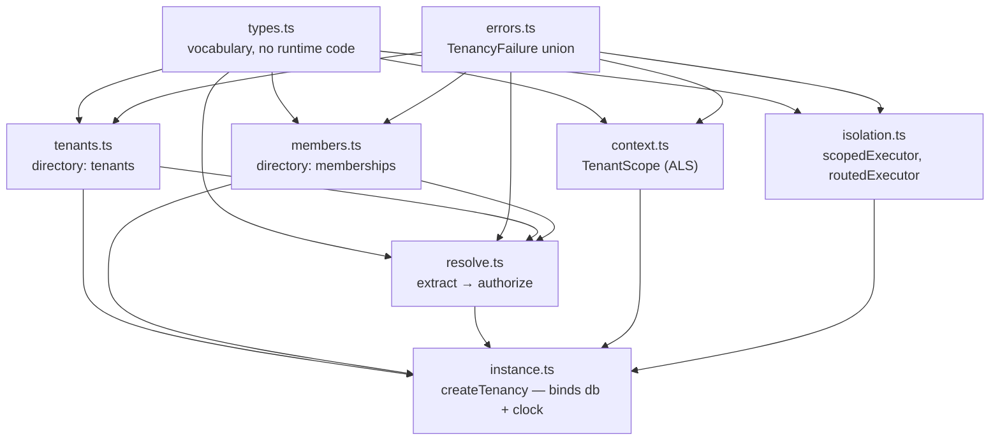

# Architecture

How tenant-kit is put together, and the rules that keep it small. Written to
the same standard as billing-kit's architecture doc: every structural choice
here should name the failure it exists to prevent.

## 1. The module map

`types.ts` and `errors.ts` have no dependencies and no runtime logic beyond
the error class; everything else depends on them and not on each other,
except `resolve.ts`, which is exactly the module whose job is to join the
directory to the request. `instance.ts` is sugar: it binds `(db, clock)` once
and owns the `TenantScope`, and every free function stays exported for
callers holding a transaction or composing their own instance.

## 2. The two-halves rule

Resolution is two functions with a typed wall between them:

| Half | Function | Input | Output | Trust |
|---|---|---|---|---|
| Extraction | `Extractor` | `RequestLike` | `TenantClaim \| null` | None. The claim is the caller's assertion. |
| Authorization | `authorize` | `TenantClaim` + `UserId` | `ResolvedTenant` | The directory and the membership table. |

The wall is the point. Post-incident writeups of multi-tenant breaches share
one sentence: *a layer treated a request-supplied tenant reference as
authenticated.* Here that sentence cannot be written in the API's types — an
extractor is pure and cannot reach the store; nothing downstream accepts a
`TenantClaim`; the only producer of `ResolvedTenant` checks membership on the
way through.

Order of authorization checks: **existence → state → membership.** Archived
beats not-a-member so an archived tenant's own users are told the truth about
it. What your HTTP layer reveals is then a single decision in one error
mapper — errors.ts documents collapsing `not_a_member` into 404 for
enumeration resistance.

`req.claims` is the one input the library must trust as handed to it: claims
from a token *your* auth layer verified. `fromClaim` reads them because
service-to-service calls carry their tenant in the token; nothing in this
library can check a signature for you, and the docstrings say so rather than
pretending otherwise.

## 3. Context: the ambient tenant

`TenantScope` wraps `AsyncLocalStorage<TenantContext>`. Three decisions:

- **Instance-owned, not module-level.** A module-level store is a global; the
  house rule (billing-kit §instance) is that two instances coexist in one
  process — a test scoping tenants over a rolled-back executor while the app
  scopes its own. `createTenancy` makes a scope; `TenantScope` is exported
  for anyone composing without the factory.
- **No `set()`.** Context enters through `run(scope, fn)` and dies with
  `fn`'s extent. A mutable ambient tenant is one whose reads cannot be
  reasoned about; nesting `run` is the sanctioned way to impersonate into a
  second tenant for a support tool, because the inner extent is visible in
  the code's shape.
- **`run` accepts a bare `TenantId`** as well as a `ResolvedTenant`, because
  background work — a queue consumer replaying a job that recorded its
  tenant, a sweep iterating tenants it just listed — legitimately owns its
  tenant choice without a request or a membership.

`require()` exists because most code paths in a multi-tenant app are wrong to
reach untenanted, and a thrown `no_tenant_context` beats each call site
wording its own null check.

## 4. Isolation

The full decision is [ISOLATION.md](ISOLATION.md); the architecture-level
summary:

- `tenancy.db()` / `scopedExecutor` make "whose rows" a property of the
  **connection state**, not of every WHERE clause. `set_config('tenancy.tenant_id',
  $1, true)` inside a transaction; policies installed by `tenancy.protect()`
  compare the row's tenant column to `tenancy.current_tenant()`.
- **FORCE** row-level security, always — the table owner is exactly what app
  connection strings authenticate as, and unforced RLS is theater for them.
- The **cast lives on the function side** of the policy
  (`col = current_tenant()::uuid`, never `col::text = current_tenant()`), so
  typed tenant columns keep their indexes.
- The directory tables themselves are **not** policied: they are what the
  resolve path reads before any scope exists. Isolation is for the host
  app's data, and for billing-kit's schema if it is present.
- `routedExecutor` is the whole database-per-tenant offering — LRU-bounded
  memoized routing over a function you write, with `dispose`/`close()` — because provisioning and per-database
  migrations are operational choices a library would only get wrong on your
  behalf.

## 5. API design rules

Inherited from billing-kit, restated because they are checkable in review:

1. **Configuration as arguments.** Every core function takes `(db, …, now)`.
   No module state, no `process.env`. `instance.ts` is binding, not hiding.
2. **Errors are a discriminated union.** `TenancyFailure` is the contract;
   messages are derived, never parsed. A caller switching on `.message` has
   reintroduced the bug this prevents.
3. **Idempotent writes; conflicting retries error by name.** Same input →
   same result (`createTenant`, `addMember`, `archiveTenant`,
   `removeMember`). Same key, different intent → `slug_taken`,
   `already_a_member` — with the difference spelled out in `detail`, so the
   caller doesn't have to query to learn what differed.
4. **Invariants live in the store, under locks.** The last-owner rule is a
   `FOR UPDATE` on the owner rows, not a read-then-write; the racing test in
   `test/members.test.ts` is the spec.
5. **The database is one narrow interface.** `SqlExecutor`, structurally
   identical to billing-kit's, satisfiable by a bare `pg.Pool` in ten lines.
   `transaction` must pin one connection — for RLS this is not a rollback
   nicety but the isolation mechanism itself.

## 6. What is deliberately absent

| Absent | Why |
|---|---|
| Users table, sessions, passwords | Auth is the host's. `UserId` is opaque; membership is checked, identity never. |
| Invitations, email flows | Workflow, not directory. Build on `addMember` with your own token table. |
| Permissions beyond three roles | Application vocabulary. `atLeast` is the only comparison the library will ever do. |
| Tenant provisioning hooks / lifecycle events | Your job queue already exists; wrap `createTenant`. |
| A framework adapter | `RequestLike` is four optional fields; every framework produces it in two lines. An adapter package would make one framework the favorite. |
| Caching of the directory | A tenant lookup is one indexed read. Cache in front if you must; the library returning stale memberships would be a security decision made for you. |
