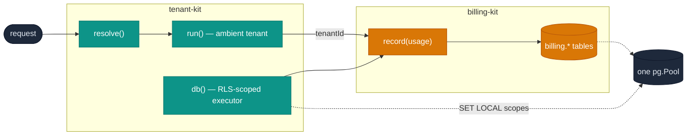

# Running tenant-kit with billing-kit

The two kits were designed as siblings: tenant-kit defines the tenant,
billing-kit bills it. Neither imports the other — the integration is two
shared shapes, which this doc walks through end to end.



## The two shared shapes

1. **`TenantId` is the same type** — opaque `text` — in both vocabularies,
   and both schemas store it as `text`. A tenant resolved by tenant-kit is
   the `tenantId` on every billing-kit usage event, subscription and ledger
   row, no casts anywhere.
2. **`SqlExecutor` is structurally identical** in both libraries: `query` +
   `transaction`, satisfiable by one `pg.Pool` adapter — tenant-kit ships
   one as `@quxkit/tenant-kit/pg`. One pool, both schemas
   (`tenancy.*`, `billing.*`), one transaction discipline.

## Wiring

```ts
import { createTenancy, firstOf, fromSubdomain, fromClaim } from '@quxkit/tenant-kit';
import { createBilling } from '@quxkit/billing-kit';
import { Quantity } from '@quxkit/billing-kit';
import { pgExecutor } from '@quxkit/tenant-kit/pg';

const db = pgExecutor(pool);          // one adapter serves both kits

const tenancy = createTenancy({ db });
const billing = createBilling({ db });

const extract = firstOf(
  fromSubdomain({ baseDomain: 'example.com' }), // browsers
  fromClaim('tenant_id'),                        // service tokens
);
```

Per request — resolve once, make the tenant ambient, and record usage with
the resolved id, never with anything read from the request body:

```ts
app.use(async (req, res, next) => {
  const resolved = await tenancy.resolve(
    { hostname: req.hostname, headers: req.headers, claims: req.auth?.claims },
    { userId: req.user.id, extract },
  );
  tenancy.run(resolved, next);
});

app.post('/v1/complete', async (req, res) => {
  const { tenantId } = tenancy.require();
  const output = await runTheActualWork(req);

  await billing.record({
    tenantId,                       // resolved + membership-checked, upstream
    subjectId: req.user.id,
    source: 'api',
    externalId: req.id,             // your request id — billing-kit dedupes on it
    metric: 'tokens.output',
    quantity: Quantity.fromBigInt(output.tokens),
    occurredAt: new Date(),
  });
  res.json(output);
});
```

The property this buys: **the `tenantId` on a billing row is never
request-supplied.** It went request → claim → directory → membership check →
context, and only then into `record`. billing-kit's docs assume its caller
established the tenant honestly; this is the layer that makes the assumption
true.

## Row-level security over the billing schema

billing-kit's tables carry `tenant_id text` on every ingest row, which means
`tenancy.protect()` works on them like any host table:

```sql
SELECT tenancy.protect('billing.usage_events');
SELECT tenancy.protect('billing.subscriptions');
```

Then hand billing-kit the scoped executor on the request path, and any
tenant-facing endpoint — usage dashboards, invoices, balances — is isolated
at the database even if a query in either library or your glue code has a
bug:

```ts
app.get('/v1/usage', async (req, res) => {
  const scoped = createBilling({ db: tenancy.db() });   // RLS-scoped executor
  res.json(await scoped.queryUsage({ metric: 'tokens.output' }));
});
```

### The one rule: workers run unscoped

billing-kit's cross-tenant machinery — the metering drain, the subscription
due-sweep — iterates *all* tenants by design. Run those on the **unscoped**
executor:

```ts
// worker process
import { createSubscriptions } from '@quxkit/billing-kit/subscriptions';

const subs = createSubscriptions({ db: tenancy.unscopedDb() });
await subs.chargeDueSubscriptions(opts); // must see every tenant's due rows
```

A sweep on a scoped executor doesn't fail — it quietly processes one
tenant and skips the rest, which for a billing sweep means revenue silently
not collected. The split to hold in review: **request-path billing calls take
`tenancy.db()`, worker-path billing calls take `tenancy.unscopedDb()`** —
the method name is the audit trail.

Note the interaction if you *do* protect billing tables: an unscoped
connection under `protect()` sees an empty table, so an unscoped worker over
protected tables finds zero due subscriptions. Two defensible resolutions —
leave billing-kit's tables unprotected and rely on its own tenant-scoped
queries (reasonable: they are library-internal, not hand-written per
feature), or protect them and run the worker as a role with `BYPASSRLS`.
Pick one deliberately. Either way the failure mode of forgetting is loud —
a sweep that finds nothing on day one, not a leak — which is the right
direction for a mistake to fail.

## Per-tenant databases, both kits

Because both kits speak `SqlExecutor`, database-per-tenant routing moves
them together:

```ts
import { routedExecutor } from '@quxkit/tenant-kit';

const dbFor = routedExecutor((tenantId) =>
  tenantId === WHALE ? pgExecutor(whalePool) : pgExecutor(sharedPool));

const { tenantId } = tenancy.require();
const billing = createBilling({ db: dbFor(tenantId) });
```

The whale's usage events, charges and ledger live in its own database; the
code path is identical.

## Archival and the ledger

`tenancy.archiveTenant()` archives — it never deletes — for billing-kit's
sake as much as anyone's: the ledger is append-only and its rows reference
the tenant id forever. An archived tenant stops resolving (`tenant_archived`),
so no new usage can be recorded through the request path, while
`billing.settle`-side reads, exports and audits keep working against the
directory row that still exists. Delete a tenant and you delete the ledger's
ability to explain itself; the API makes the safe thing the only thing.
